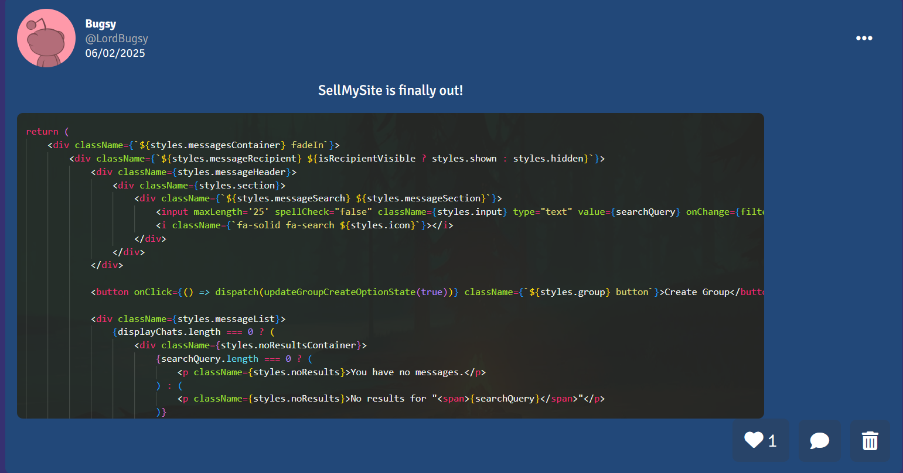

# SellMySite


SellMySite is a social media platform where users can create posts, share their websites, interact with other creators, search for posts and websites, and even sell their posts. It provides a marketplace for creators to showcase and monetise their content while engaging with a community of like-minded individuals.

## Features

**Create Posts** - Share updates, ideas, and content with the community.
**Website Listings** - Showcase and sell websites to interested buyers.
**Search Functionality** - Easily find posts and websites using an optimised search system.
**User Interaction** - Engage with other creators through comments and messages.

### New Features

**Admin Panel** - Admins have the ability to:
- Make announcements
- Create redeemable codes
- Ban users
**Image Support for Posts** - Attach images to posts (Currently, only Imgur images are accepted).
**Group Chats** - Create group chats with up to 10 participants and share images within the conversation.
**Create & Redeem Codes** - Generate and use codes to earn siteTokens.
**Pagination with IntersectionObserver** - Load large amounts of comments efficiently without impacting performance.

## Installation

1. Clone the repository:
```bash
git clone https://github.com/LordBugsy/SellMySite.git
```

2. Navigate to the project directory:
```bash
cd sellmysite
```

3. Install dependencies:
```bash
npm install
```

4. Start the development server:
```bash
npm start
```

## Contributing

Contributions are welcome! If you want to report a bug or suggest a feature, feel free to open an issue, submit a pull request or contact me on [Twitter](https://x.com/mylordbugsy)!

## License
This project is provided under a custom license. Users are allowed to view, learn from the code, modify it or redistribute it, but they may not use it for commercial purposes. See the [LICENSE](./LICENSE.txt) file for details.

## Miscellaneous
This project took me more than 3 months to complete! If you find any bugs, please let me know as soon as possible so I can fix them! 

Anyway, I hope you will have fun with **SellMySite**! À la prochaine!
Copyright 2024 LordBugsy. All Rights Reserved.